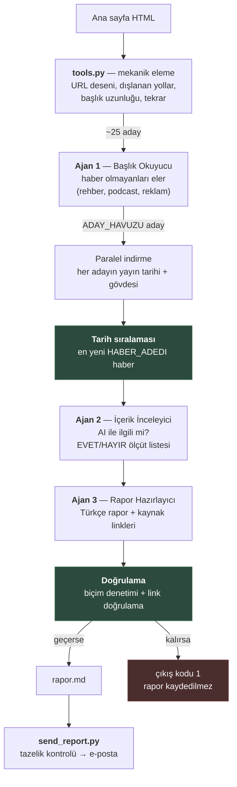
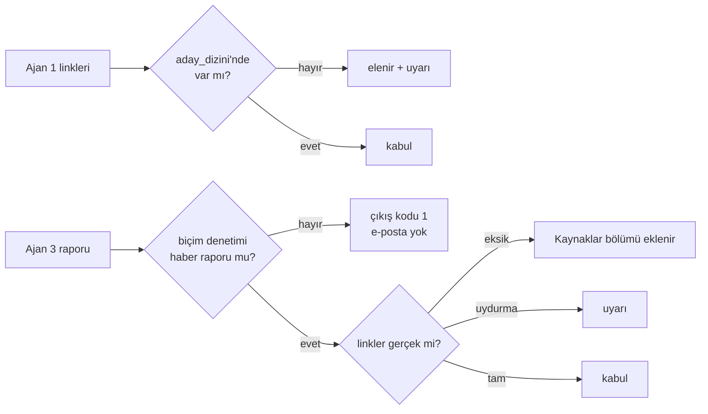
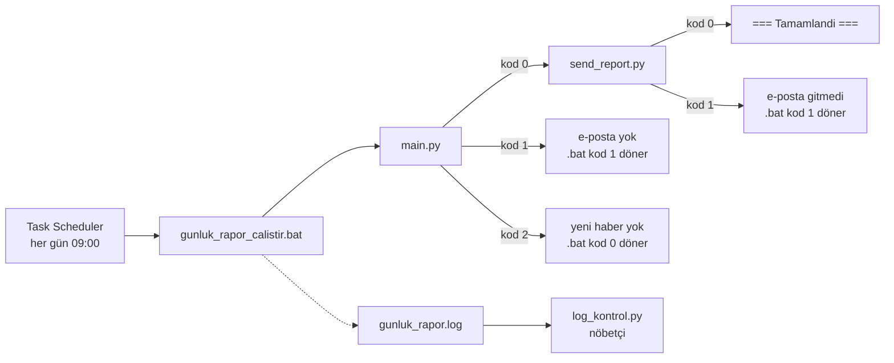

# Mimari

## Akış

Yeşil kutular **deterministik** adımlardır — LLM kullanılmaz. Kesin cevabı olan
işler (sıralama, doğrulama) ajana sorulmaz.

## Ajanların rolleri

| Ajan | Girdi | Çıktı | Neden LLM? |
|---|---|---|---|
| 1 — Başlık Okuyucu | Ham başlık + link adayları | Ayıklanmış aday havuzu | Ana sayfa HTML'i dağınık; "bu haber, bu reklam" ayrımı kural yazmakla bitmez |
| 2 — İçerik İnceleyici | Makale gövde metni | `{ai_ile_ilgili, aciklama}` | Başlığa değil içeriğe bakarak karar verir; ölçüt listesi verilir ama yorum gerekir |
| 3 — Rapor Hazırlayıcı | Sınıflandırma sonuçları | Türkçe rapor | Yapılandırılmış veriyi insana okunur anlatıya çevirir |

Ajan 2 ucuz ve hızlı model kullanır (`claude-haiku-4-5`) çünkü haber başına bir
kez çağrılır. Ajan 1 ve 3 daha güçlü modelle çalışır (`claude-opus-5`).

## Ajan çıktısına neden güvenilmez?

Her ajanın çıktısı deterministik kodla doğrulanır:

Bu katmanların her biri gerçek bir hatadan sonra eklendi:

- **Link doğrulama** — Ajan 3 bazı haberleri linksiz bırakıyordu.
- **Biçim denetimi** — Ajan 3'ün promptu bozulduğunda haber raporu yerine
  sınıflandırma denetimi yazdı. Çıktı biçimsel olarak kusursuzdu: taze tarihli,
  doğru linkli, hatasız çalışan bir belge — ama yanlış belge. Çıkış kodları,
  tazelik kontrolü ve log nöbetçisi dahil hiçbir denetim yakalamadı, çünkü hepsi
  *"çalıştı mı"* sorusunu sorar, *"doğru şeyi mi yaptı"* sorusunu değil.

## Neden iki aşamalı seçim?

Ana sayfa kronolojik değil **editoryal** olarak dizilidir: öne çıkarılan, günler
öncesine ait bir haber listenin en üstünde durabilir. Yayın tarihi de ana sayfa
HTML'inde bulunmaz; yalnızca makale sayfasının `article:published_time` meta
etiketindedir.

Bu yüzden önce Ajan 1 haber olmayanları eler, sonra kalan havuzun **tamamının**
sayfası indirilip tarihe göre sıralanır. `ADAY_HAVUZU` bu maliyetin ayarıdır:
havuz genişledikçe sıralama isabetli olur, karşılığında daha çok sayfa indirilir.
Pahalı olan LLM çağrıları yalnızca sıralamayı kazanan haberler için yapılır.

## Zamanlanmış çalışma

Çıkış kodları kritik: `main.py` hata durumunda düz `return` yapsaydı kod 0
dönerdi ve `.bat` bunu başarı sanıp **bir önceki günün raporunu** yeniden
e-postalardı.
